# Flowchart dell’analisi — DA-INVENT

Documento di **verifica funzionale**: descrive in sequenza le fasi di acquisizione dati, onboarding, scansioni e collegamento switch↔IPAM. I riferimenti al codice permettono di controllare che la documentazione sia allineata all’implementazione.

**Versione progetto:** vedi `package.json` → `version`.

---

## 1. Panoramica: dal primo avvio all’analisi della subnet

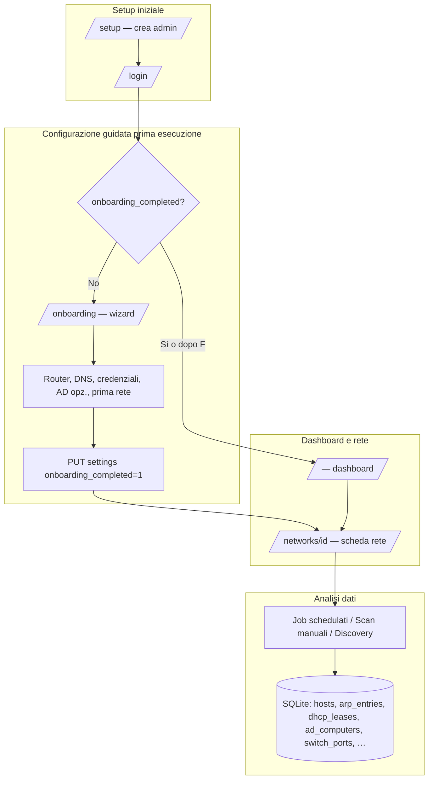

**Controlli nel codice**

| Elemento | Dove |
|----------|------|
| Flag `onboarding_completed` | `src/lib/db.ts` (`settings`), migrazione in `getDb()` |
| Wizard UI | `src/app/onboarding/onboarding-wizard.tsx` |
| Redirect se onboarding incompleto | `src/components/shared/app-shell.tsx` + `GET /api/onboarding/status` |
| Pipeline concettuale 15 fasi | `src/lib/scanner/subnet-evaluation-pipeline.ts` |

---

## 2. Configurazione guidata (`/onboarding`) — ordine operativo

Sequenza proposta al primo accesso (dopo login), prima di marcare `onboarding_completed`.

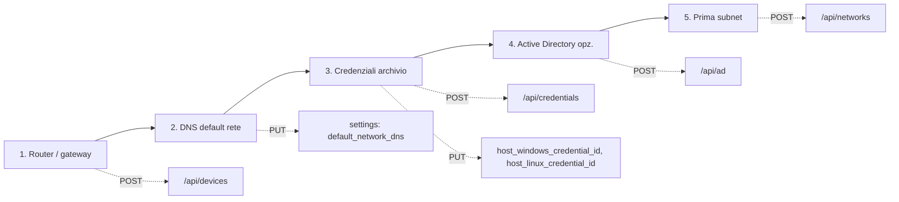

**Esito**

- **Crea rete e apri analisi:** `POST /api/networks` → redirect a `/networks/{id}`.
- **Esci / Salta rete:** solo `onboarding_completed=1` → dashboard.

---

## 3. Modello logico: “prima analisi” subnet (15 fasi)

Ordine e titoli sono definiti in **`SUBNET_EVALUATION_PHASES`** (`subnet-evaluation-pipeline.ts`). Non esiste un singolo job che esegue tutte le fasi in un unico comando; molte sono **azioni distinte** (UI, API, cron) collegate dagli stessi dati.

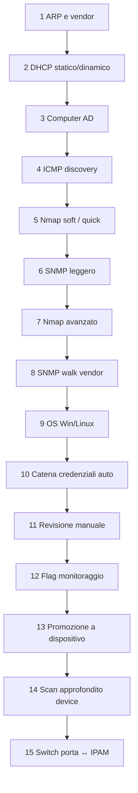

### Tabella di tracciamento (verifica implementazione)

| # | ID fase | Cosa fa | Riferimento implementazione |
|---|---------|---------|------------------------------|
| 1 | `arp_vendor` | MAC↔IP, vendor OUI | `arp_poll`, `arp_entries`, campi host |
| 2 | `dhcp_leases` | Lease → `ip_assignment` | `dhcp_leases`, `ad_dhcp_leases`, `syncIpAssignmentsForNetwork` |
| 3 | `ad_computers` | Allineamento PC AD ↔ host | `ad-client` sync, `ad_computers`, link host |
| 4 | `icmp_discovery` | Ping sweep | `scan_type` `ping`, `network_discovery`, `ipam_full` fase 1 |
| 5 | `nmap_soft` | Porte TCP quick | `network_discovery`, `ipam_full` fase 2 |
| 6 | `snmp_light` | sysName/sysDescr/OID base | `network_discovery`/`nmap`/`ipam_full` fase 3, `snmp` scan |
| 7 | `nmap_advanced` | Profilo Nmap pieno | `scan_type` `nmap` + `nmap_profiles` |
| 8 | `snmp_walk_vendor` | OID per vendor | `snmp_vendor_profiles`, scan SNMP |
| 9 | `os_detect_win_linux` | WinRM / SSH | `scan_type` `windows`, `ssh`; in `ipam_full` solo SSH integrato |
| 10 | `credential_chain_auto` | Prove credenziali rete | `network_host_credentials`, `host_detect_credential` |
| 11 | `manual_review` | UI host/rete | `PUT /api/hosts/[id]` |
| 12 | `monitor_flag` | Host conosciuti | `known_host`, job `known_host_check` |
| 13 | `promote_to_device` | Host → `network_device` | `POST /api/devices/bulk`, ecc. |
| 14 | `device_deep_scan` | Query router/switch/API | client dispositivo, scan dedicati |
| 15 | `switch_port_ipam_link` | MAC su porta → host | `resolveMacToDevice`, `switch_ports.host_id`, ARP poll |

---

## 4. Orchestrazione interna: `discoverNetwork` (`discovery.ts`)

Tipi di scan: `ping` | `network_discovery` | `snmp` | `nmap` | `windows` | `ssh` | `ipam_full`.

### 4.1 `network_discovery`

**Sequenza nel codice:** ICMP → Nmap TCP quick sugli online → (blocco comune) persistenza host/classificazione → **ARP dal router** sugli IP online → annotazione host non rispondenti.

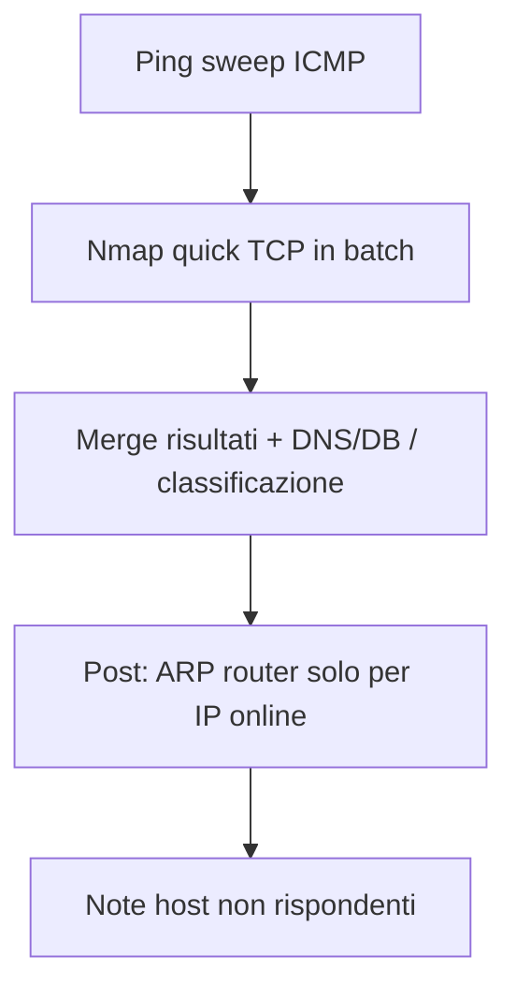

### 4.2 `ipam_full` (pipeline in 4 + post)

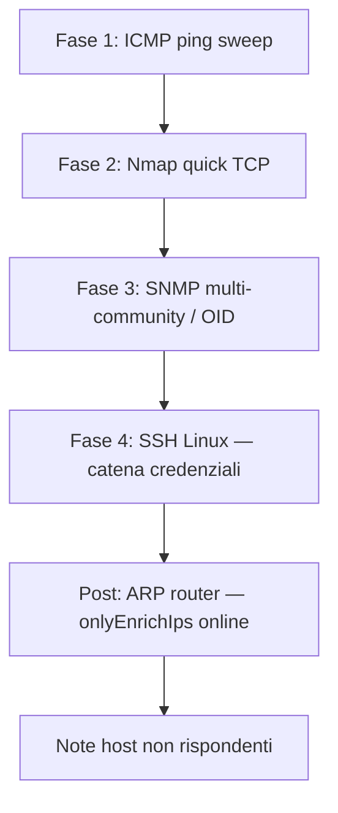

**Nota:** la fase WinRM non è inclusa dentro `ipam_full`; per Windows usare lo scan separato `scan_type` **`windows`** (dopo aver popolato le porte con Nmap).

### 4.3 Scansioni “solo ruolo”

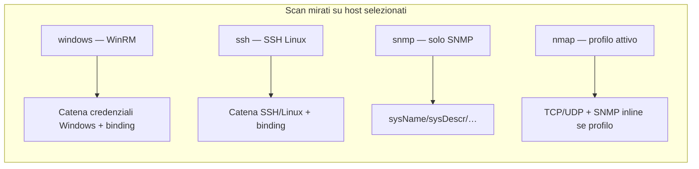

**API:** `POST /api/scans/trigger` con `scan_type` e `host_ids` (per tipi manuali è richiesta la selezione IP). Vedi `src/app/api/scans/trigger/route.ts`.

---

## 5. Flusso ARP, DHCP e DNS (trigger e dati)

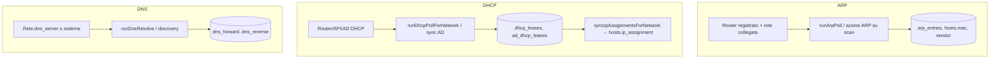

**Trigger manuale** (`/api/scans/trigger`): `arp_poll`, `dhcp`, `dns` su `network_id` (+ host selezionati dove previsto).

---

## 6. Active Directory: sync e DHCP Microsoft

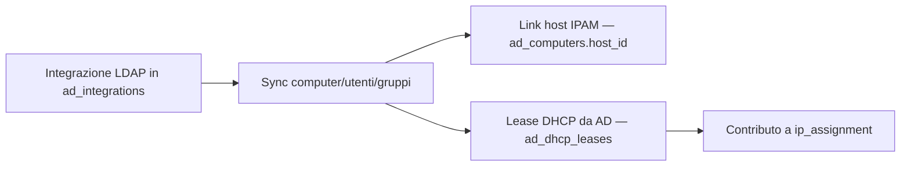

Implementazione principale: `src/lib/ad/ad-client.ts` (sync), tabelle `ad_*` in `src/lib/db.ts`.

---

## 7. Switch: MAC su porta → IPAM

Allineato a `implementationHint` fase 15 della pipeline.

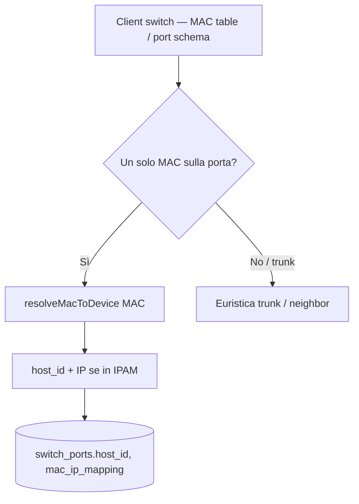

Codice di riferimento: `runArpPoll` / creazione client switch in `src/lib/cron/jobs.ts`, `resolveMacToDevice` in `src/lib/db.ts`.

---

## 8. Job schedulati (cron) — mappa tipi

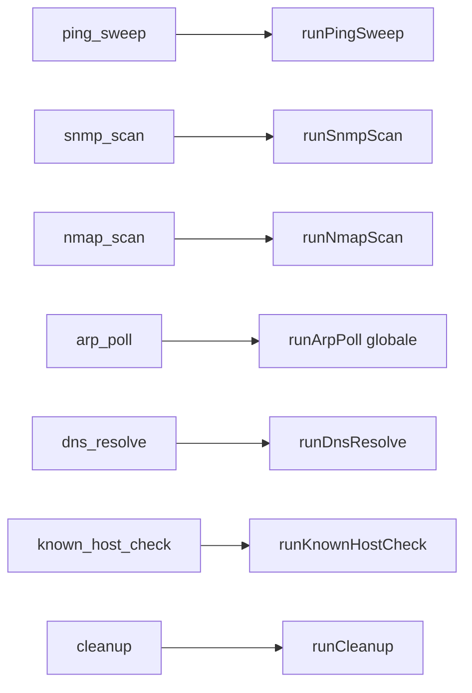

Definizione switch: `src/lib/cron/jobs.ts` → `runJob`.

---

## 9. Classificazione e fingerprint (dopo porte/SNMP)

Ordine semplificato documentato in `docs/DEVICE-ASSIGNMENT-E-MAPPING.md` e nel codice `discovery.ts`:

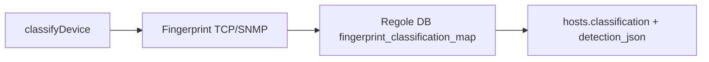

---

## 10. Checklist di verifica manuale

Usare questa lista per un test end-to-end su ambiente di prova.

1. **Setup:** creare admin, login, completare o saltare `/onboarding`.
2. **Rete:** almeno un router in `network_devices`, rete con CIDR, DNS se necessario, credenziali collegate alla rete.
3. **Discovery:** eseguire `network_discovery` o `ipam_full` dalla UI (o API) su una subnet piccola; verificare progress e log.
4. **ARP:** dopo discovery, verificare MAC su host; oppure job `arp_poll` dedicato.
5. **DHCP:** se applicabile, polling DHCP e valori `ip_assignment` in tabella host.
6. **AD:** se configurato, sync e presenza `ad_dns_host_name` dove previsto.
7. **Switch:** dopo poll che include switch, verificare `switch_ports` e collegamento host per porte a MAC singolo.
8. **Credenziali:** scan `windows` / `ssh` su IP selezionati con porte già note; verificare `host_detect_credential`.

---

## 11. File e endpoint principali (indice rapido)

| Area | File / route |
|------|----------------|
| Pipeline fasi (meta) | `src/lib/scanner/subnet-evaluation-pipeline.ts` |
| Orchestrazione scan | `src/lib/scanner/discovery.ts` |
| Trigger scan manuale | `src/app/api/scans/trigger/route.ts` |
| Job cron | `src/lib/cron/jobs.ts`, `src/lib/cron/scheduler.ts` |
| Onboarding | `src/app/onboarding/*`, `src/app/api/onboarding/status/route.ts` |
| AD | `src/lib/ad/ad-client.ts`, `src/app/api/ad/*` |
| Auth API admin | `src/lib/api-auth.ts` (`requireAdmin` su POST mutazioni) |
| Assegnazione tipo host (SNMP + fingerprint + anomalie) | `docs/IPAM-ASSEGNAZIONE-DEVICE-SNMP-FINGERPRINT.md` |

---

*Documento generato per supportare audit e regression test del flusso di analisi. Aggiornare questo file quando si aggiungono nuove fasi o si unifica l’orchestrazione in un unico job.*
