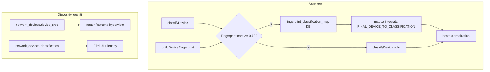

# Assegnazione dispositivi: tabelle, mapping e dove intervenire

Questo documento descrive **come DA-INVENT assegna ruoli e categorie** agli oggetti nel database, così puoi modificare regole, valori ammessi o mapping senza dover rileggere tutto il codice.

---

## 1. Due mondi distinti (non confonderli)

| Concetto | Tabella principale | Ruolo |
|----------|-------------------|--------|
| **Host IPAM** (indirizzi sulla rete) | `hosts` | Ogni riga è un IP in una `networks`; qui vive la **classificazione inventario** (PC, VM, switch, …). |
| **Dispositivo di rete gestito** | `network_devices` | Router, switch e hypervisor che interroghi via SSH/SNMP/API; qui vive **`device_type`** + **`vendor`** + credenziali. |

Le liste UI tipo «Dispositivi → Router / Switch / Hypervisor» leggono **`network_devices`**. Le viste per tipo (PC, VM, stampanti, …) leggono **`hosts.classification`**.

---

## 2. Tabella `hosts` — classificazione per IP

| Campo | Significato |
|-------|-------------|
| `classification` | Slug del tipo (es. `hypervisor`, `workstation`, `switch`). Valori ammessi: vedi sezione [Classificazioni ammesse](#5-classificazioni-ammesse-hostsclassification). |
| `detection_json` | JSON del **fingerprint** (porte, SNMP, banner, `final_device`, `final_confidence`). |
| `hostname`, `hostname_source` | Nome risolto (SNMP, DNS, DHCP, …). |
| `dns_reverse`, `dns_forward` | Esito verifica PTR + forward coerente. |

### Flusso durante lo scan (semplificato)

1. **`classifyDevice()`** (`src/lib/device-classifier.ts`): regole su OID SNMP, testo `sysDescr`, hostname, porte aperte, vendor MAC, contesto SNMP.
2. **Fingerprint** (`src/lib/scanner/device-fingerprint.ts`): firme TCP + probe leggeri → `final_device` + `final_confidence`.
3. **`getClassificationFromFingerprintSnapshot()`** (`src/lib/device-fingerprint-classification.ts`): se `final_confidence ≥ 0.72` e il tipo è noto, la classificazione **del fingerprint vince** su `classifyDevice`.
4. Regole utente da DB (**tabella `fingerprint_classification_map`**) hanno priorità sulla mappa integrata `final_device` → slug.

Ordine effettivo in `discovery.ts`:

```text
classificazione = (da fingerprint + regole DB + mappa integrata) ?? (da classifyDevice) ?? "unknown"
```

---

## 3. Tabella `network_devices` — infrastruttura gestita

| Campo | Vincoli / uso |
|-------|----------------|
| `device_type` | Solo: `router`, `switch`, `hypervisor` (CHECK SQL). |
| `vendor` | Elenco fisso in schema: `mikrotik`, `ubiquiti`, `cisco`, `proxmox`, … |
| `protocol` | `ssh`, `snmp_v2`, `snmp_v3`, `api`, `winrm`. |
| `classification` | Slug opzionale per filtri UI (es. `router`, `switch`, `hypervisor`, `storage`…). Se `NULL`, per router/switch si usa ancora `device_type` (compatibilità legacy). |
| `scan_target` | Opzionale: `proxmox`, `vmware`, `windows`, `linux` — modula scan/query. |

**Query di raggruppamento** (esempio da `src/lib/db.ts`):

- Router in lista: `classification = 'router'` **oppure** (`device_type = 'router'` e `classification` vuota).
- Stesso schema per switch.

Per aggiungere un nuovo **tipo** di `network_devices` serve aggiornare: `db-schema.ts` (CHECK), migrazioni in `db.ts` se presenti, `validators.ts`, tipi in `src/types/index.ts`, client router/switch dove serve.

---

## 4. Altre tabelle di «assegnazione»

| Tabella | Scopo |
|---------|--------|
| **`network_router`** | `(network_id, router_id)` — quale **router** interroghi per ARP/DHCP su quella subnet. |
| **`fingerprint_classification_map`** | Regole personalizzate: `match_kind` (`exact` / `contains`), `pattern`, `classification`, `priority`, `enabled`. Mappa stringhe tipo etichetta fingerprint → slug `hosts.classification`. Gestibile da **Impostazioni** nell’app. |
| **`arp_entries`** | ARP raccolta da un `network_devices` (router). |
| **`mac_port_entries`** | MAC table da switch. |
| **`switch_ports`** | Schema porte + incrocio MAC/IP (router/switch). |
| **`network_host_credentials`** / **`host_detect_credential`** | Credenziali per host (detect), non sono classificazione ma acquisizione dati. |

---

## 5. Classificazioni ammesse (`hosts.classification`)

Elenco canonico in codice: `src/lib/device-classifications.ts` → costante **`DEVICE_CLASSIFICATIONS`**.

Include tra gli altri: `router`, `switch`, `firewall`, `access_point`, `server`, `server_windows`, `server_linux`, `workstation`, `notebook`, `vm`, `hypervisor`, `storage`, `nas`, `nas_synology`, `nas_qnap`, `stampante`, `telecamera`, `voip`, `ups`, vari ruoli server (DNS, DHCP, mail, …), IoT/OT, media, `unknown`.

**Macro-gruppi** (dashboard): `getDeviceCategoryGroup()` nello stesso file — utile se aggiungi nuovi slug e vuoi capire in quale gruppo finiscono in UI.

---

## 6. Mappa integrata: etichetta fingerprint → classificazione host

Definita in **`src/lib/device-fingerprint-classification.ts`** → oggetto **`FINAL_DEVICE_TO_CLASSIFICATION`**.

Corrisponde ai nomi prodotti dal fingerprint (firme porte + logica in `device-fingerprint.ts`). Esempi di `final_device` dalle firme porte:

| `final_device` (firma porte) |
|------------------------------|
| Proxmox VE, Synology DSM, QNAP QTS, TrueNAS |
| MikroTik RouterOS, UniFi Controller |
| Stormshield SNS, pfSense/OPNsense |
| Hikvision, Dahua / NVR, Telecam XMEye/clone |
| Windows Server, Linux generico, Linux/net-snmp |
| HPE iLO, PBX SIP (FreePBX/3CX), Zabbix, Wazuh |

Altri `final_device` possono arrivare da rami SNMP/OID in `device-fingerprint.ts` (es. etichette Cisco/Synology): in quel caso la mappa in `FINAL_DEVICE_TO_CLASSIFICATION` o una riga in **`fingerprint_classification_map`** decide lo slug finale.

**Soglia di confidenza:** `FINGERPRINT_CLASSIFICATION_MIN_CONFIDENCE = 0.72` — sotto questa soglia il fingerprint **non** sovrascrive la classificazione da `classifyDevice`.

---

## 6.bis Porte Nmap e sync dispositivi gestiti

Durante lo scan Nmap profilo: **TCP** — porte `open` e `open|filtered`; **UDP** — solo `open` (gli stati `open|filtered` su UDP non vengono memorizzati, per evitare falsi positivi tipici delle scansioni UDP).

- **Sessione unificata per IP:** dopo TCP+UDP (due invocazioni Nmap), nella stessa esecuzione viene eseguito **SNMP** (walk/query + firme OID): le porte e i metadati SNMP si **sommano** al risultato della sessione.
- In persistenza, `open_ports` è l’**unione** (`mergeOpenPortsJson`) tra quanto già in archivio e la sessione corrente, così non si perdono TCP se uno scan precedente o una fase ha lasciato solo UDP (o viceversa).
- Da SNMP si salvano anche **modello**, **seriale**, **firmware** e **produttore** (`hosts.model`, `hosts.serial_number`, `hosts.firmware`, `hosts.device_manufacturer`) quando disponibili.
- La classificazione e il fingerprint ricevono la lista aggiornata di porte e i dati SNMP.
- Se l'host corrisponde a un `network_devices` esistente (stesso IP), la funzione **`syncNetworkDeviceFromHostScan`** aggiorna automaticamente:
  - **`port`**: se la porta attuale del device non è tra quelle rilevate, viene assegnata una porta candidata appropriata per protocollo/vendor.
  - **`classification`**: allineata a quella dell'host se più specifica (solo per router/switch/hypervisor).

---

## 7. Cosa modificare per obiettivo

| Obiettivo | Dove intervenire |
|-----------|------------------|
| Nuova regola su testo/OID/porte (senza toccare fingerprint) | `src/lib/device-classifier.ts` (`TEXT_RULES`, OID rules, …). |
| Nuova firma o peso porte / Proxmox / Linux | `src/lib/scanner/device-fingerprint.ts` (`PORT_SIGNATURES` e logica collegata). |
| Nuovo `final_device` → slug classificazione | `FINAL_DEVICE_TO_CLASSIFICATION` in `device-fingerprint-classification.ts` **oppure** riga in tabella `fingerprint_classification_map` (consigliato per personalizzazioni senza deploy). |
| Cambiare soglia 0.72 | Costante `FINGERPRINT_CLASSIFICATION_MIN_CONFIDENCE` in `device-fingerprint-classification.ts` (e allineare commenti in `discovery.ts` se citata). |
| Nuovi valori `hosts.classification` | `device-classifications.ts` + eventuali label in UI / validatori che elencano i tipi. |
| Nuovo tipo `network_devices` | `db-schema.ts`, migrazioni `db.ts`, `validators.ts`, `types/index.ts`, pagine form dispositivi. |
| Quale router usa ARP per una rete | Tabella `network_router` (UI rete / API reti). |

---

## 8. Diagramma riassuntivo



---

## 9. Riferimenti file

| File | Contenuto |
|------|-----------|
| `src/lib/db-schema.ts` | DDL tabelle e CHECK. |
| `src/lib/db.ts` | `getDevicesByClassificationOrLegacy`, `network_router`, CRUD `fingerprint_classification_map`. |
| `src/lib/scanner/discovery.ts` | Unione fingerprint + classifier + `upsertHost`; sync `network_devices` via `syncNetworkDeviceFromHostScan`. |
| `src/lib/device-classifier.ts` | Regole automatiche testo/OID/porte. |
| `src/lib/scanner/device-fingerprint.ts` | Firme porte e snapshot. |
| `src/lib/device-fingerprint-classification.ts` | Mapping `final_device` → slug + regole DB. |
| `src/lib/device-classifications.ts` | Elenco slug e gruppi UI. |
| `docs/DEVICE-FINGERPRINTING.md` | Dettaglio fingerprint (porte, OID, ecc.). |

---

*Documento generato per supportare modifiche a classificazione e assegnazione dispositivi. Aggiornalo se cambi CHECK SQL o il flusso in `discovery.ts`.*
