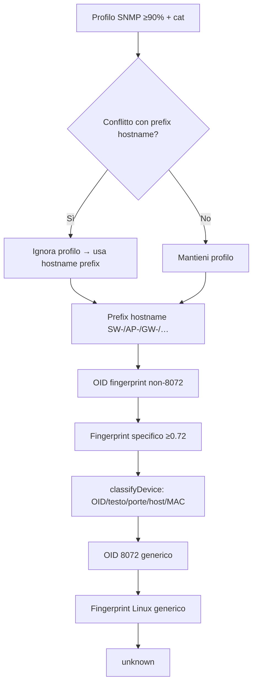

# IPAM: assegnazione tipo dispositivo (SNMP, fingerprint, regole)

Documento **operativo** per capire come viene scelta `hosts.classification` durante gli scan, perché compaiono **anomalie** (es. switch classificato come server Linux, Ubiquiti ambigui) e **come correggere** senza indovinare.

**Riferimenti correlati:** `docs/DEVICE-ASSIGNMENT-E-MAPPING.md` (panorama tabelle), `docs/ANALISI-FLOW-FLOWCHART.md` (flusso analisi).

---

## 1. Due livelli da non confondere

| Oggetto | Tabella | Cosa rappresenta |
|---------|---------|------------------|
| **Host IPAM** | `hosts` | Un IP nella subnet: qui finisce **`classification`** (PC, switch, NAS, …) e **`detection_json`** (fingerprint). |
| **Dispositivo gestito** | `network_devices` | Infrastruttura che interroghi (router/switch/hypervisor): **`device_type`**, **`vendor`** scelti da te; **non** viene sovrascritto dalle scansioni host. |

Questo documento riguarda soprattutto **`hosts.classification`** e il JSON **`hosts.detection_json`**.

---

## 2. Dati in ingresso (cosa “vede” il motore)

Per ogni IP online, durante `network_discovery`, `nmap`, `snmp`, `ipam_full`, `discovery.ts` costruisce:

1. **Porte** — unione tra archivio e sessione corrente (`mergeOpenPortsJson`), così una scansione parziale non fa perdere porte già note (es. 8006 Proxmox).
2. **SNMP** — `sysName`, `sysDescr`, `sysObjectID`, walk OID (profili vendor), `snmpFingerprintOidMatches[]` (etichetta + classificazione per prefisso OID).
3. **Hostname** — priorità **SNMP sysName** rispetto a DNS reverse.
4. **MAC / vendor OUI** — da ARP/Nmap.
5. **Fingerprint** (`buildDeviceFingerprint`) — firme su porte + SNMP + (opzionale) probe HTTP/SSH/SMB → `final_device`, `final_confidence`, `detection_json` se abilitato.

---

## 3. Catena di priorità finale (ordine reale in `discovery.ts`)

La classificazione salvata è **la prima** disponibile in questa lista (dopo `??` si passa al passo successivo). Commenti nel codice: `src/lib/scanner/discovery.ts` (circa righe 1281–1352).

```text
0. Profilo vendor SNMP ad alta confidenza (≥ 0.90) → vendorProfileCategory
   — se in conflitto con hostname prefix (es. SW- vs profilo Ubiquiti), VINCE il prefix hostname
1. Override hostname prefix (SW-, USW-, AP-, GW-, FW-, …)
2. OID enterprise “specifico” dal fingerprint snmp (primo match, ESCLUSO net-snmp 8072)
3. Fingerprint final_device NON generico + confidenza ≥ 0.72 → slug via regole DB + mappa integrata
   — ESCLUSI “Linux generico” e “Linux/net-snmp” a questo punto (non competono qui)
4. classifyDevice() — regole classiche (OID, testo, porte, hostname, MAC vendor, …)
5. OID generico net-snmp (8072) — solo se non c’è nulla di più specifico sopra
6. Fingerprint “Linux generico” / “Linux/net-snmp” — ultimo fallback
```

Se tutto fallisce → **`unknown`**.

### Diagramma Mermaid



### Perché “Linux/net-snmp” e “Linux generico” sono trattati diversamente

Molti dispositivi (NAS, switch Ubiquiti, Proxmox) espongono **SNMP net-snmp** (`…8072…`). L’etichetta fingerprint “Linux/net-snmp” descrive l’**agente**, non il prodotto. Per questo:

- **non** competono al punto 3 (fingerprint “specifico”);
- entrano solo come **ultimo fallback** (punto 6), dopo `classifyDevice` e dopo l’OID 8072.

---

## 4. Soglia fingerprint → classificazione

- **Costante:** `FINGERPRINT_CLASSIFICATION_MIN_CONFIDENCE = 0.72` in `src/lib/device-fingerprint-classification.ts`.
- Sotto **0.72**, `getClassificationFromFingerprintSnapshot` **non** produce slug: il fingerprint può comunque essere salvato in `detection_json` per la UI, ma **non** vince sulla catena.

**Ordine dentro `getClassificationFromFingerprintSnapshot`:**

1. Regole utente da DB (**`fingerprint_classification_map`**) — `priority` crescente, `exact` / `contains`.
2. Mappa integrata **`FINAL_DEVICE_TO_CLASSIFICATION`** (es. “Proxmox VE” → `hypervisor`, “Synology DSM” → `storage`).
3. Euristiche su stringa (`proxmox`, `vmware`, `hyper-v`, …).

---

## 5. Cosa fa `classifyDevice()` internamente (`device-classifier.ts`)

`classifyDevice()` è il **punto 4** della catena globale. Ordine interno (semplificato):

1. **Porta TCP 8006** → `hypervisor` (Proxmox) prima degli OID, perché spesso l’OID è `8072` generico.
2. **sysObjectID** — regole OID per prefissi (MikroTik, Cisco, Ubiquiti parziali, Synology, QNAP, …).  
   **Speciale `1.3.6.1.4.1.8072` (net-snmp):** disambiguazione con `sysDescr`/hostname/MAC (Proxmox, Synology, QNAP, prefissi hostname `sw-`, `ap-`, …) prima di cadere in `server_linux`.
3. **MAC virtuale** (VMware, Hyper-V, …) + porte 445/22/8006.
4. **TEXT_RULES** su testo unificato (sysDescr, osInfo, hostname, snmpContext).
5. **HOSTNAME_RULES** (pattern più lunghi).
6. **VENDOR_RULES** (OUI).
7. **PORT_RULES** (ultima: SNMP solo 161 è “debole”).

La funzione **`classifyDeviceDetailed`** restituisce anche `method` e `confidence` (per audit futuro); in persistenza si usa solo `classification`.

---

## 6. Probe fingerprint “pesanti” (HTTP/SSH/SMB)

- Variabili ambiente:
  - **`DA_INVENT_FINGERPRINT_PROBES_MAX_HOSTS`** (default **8**): se gli host online sono **più** di questo soglia, i probe attivi sono **disattivati**; restano solo firme porte/SNMP.
  - **`DA_INVENT_FINGERPRINT_PROBES=false`** — disattiva del tutto i probe pesanti.
- Effetto: su subnet grandi, `final_confidence` può **restare bassa** o `final_device` meno specifico → più spesso vince `classifyDevice` o `unknown`.

---

## 7. Protezione classificazione manuale

- Se imposti la classificazione dalla **UI** (`PUT` host con `classification`), il DB imposta **`classification_manual = 1`**.
- Gli scan successivi **non** sovrascrivono `classification` per quell’host (`upsertHost` in `src/lib/db.ts`).

**Sanazione:** per far riprendere l’automazione, va azzerato il flag (es. da refresh rete o API che supporta `classification_manual = 0` — vedi `networks/[id]/refresh`).

---

## 8. Tabella anomalie frequenti e come sanarle

| Sintomo | Cause probabili | Cosa fare |
|--------|------------------|-----------|
| **Switch/AP Ubiquiti classificato come `server_linux` o `access_point` errato** | OID `41112` generico o profilo SNMP vs realtà; fingerprint “Linux/net-snmp”. | **Rinominare** host con `sysName` coerente (`SW-`, `USW-`, `AP-`, `GW-`) — vince **prefix hostname** (`discovery.ts`). Oppure regola in **`fingerprint_classification_map`** su stringa `final_device`. Verificare **profilo SNMP** (`snmp_vendor_profiles`) e `vendorProfileConfidence`. |
| **Proxmox come `server_linux`** | OID 8072 + scan senza porta 8006 in sessione. | Assicurarsi che **8006** sia nelle porte merged (scan completo o merge archivio). La regola porta 8006 in `classifyDevice` ha priorità. |
| **NAS Synology/QNAP come server** | Stesso problema 8072. | Controllare `sysDescr` in `snmp_data`; regole OID/text in `classifyDevice` coprono molti casi; altrimenti **mappa fingerprint** o classificazione manuale. |
| **`unknown` dopo scan** | Poche porte aperte, SNMP chiuso, fingerprint &lt; 0.72, probe disattivati (troppi host online). | **Ridurre** subnet per scan o alzare `DA_INVENT_FINGERPRINT_PROBES_MAX_HOSTS` solo in test; eseguire **Nmap** con profilo che include più porte; abilitare SNMP sul device. |
| **Classificazione “giusta” poi sovrascritta** | Scan successivo con dati diversi. | È normale: la classificazione auto **non** è `preserve` per `classification` (solo `classification_manual` = blocco). Per **bloccare**: imposta classificazione da UI. |
| **`detection_json` che non aggiorna** | Logica merge: se il nuovo fingerprint ha **meno** porte e **confidenza inferiore**, l’update può essere saltato. | Nuovo scan con più porte / confidenza maggiore; o pulizia manuale `detection_json` (solo se sai cosa fai). |
| **Stampante classificata come PC** | Vendor MAC “HP Inc” vs stampante; ordine regole. | Controllare **OID** stampante (`11.2.3.9.1` in `device-classifier`); porte 9100/515; **sysDescr**. |
| **Stesso brand, tipi diversi (es. Cisco)** | OID generico Cisco `9.1` → router di default. | Modello più specifico in `OID_RULES` o testo in `sysDescr`; oppure classificazione manuale / regola fingerprint. |

---

## 9. Strumenti di correzione (senza modificare il codice)

1. **Impostazioni → mappa fingerprint** (`fingerprint_classification_map`): pattern `exact`/`contains` su `final_device` come mostrato in scheda host → slug `classification`. Priorità rispetto alla mappa integrata.
2. **Classificazione manuale** sulla scheda host (blocca sovrascritture automatiche).
3. **Naming**: hostname/SNMP con prefissi `SW-`, `USW-`, `AP-`, `GW-`, … — integrati in `discovery.ts`.
4. **Scan mirati**: dopo Nmap completo, eseguire **SNMP** o **`ipam_full`** su IP selezionati (più dati → migliore catena).
5. **Variabili ambiente** per probe fingerprint su subnet piccole (vedi sezione 6).

---

## 10. Strumenti per sviluppatori (con deploy)

| Obiettivo | File |
|-----------|------|
| Nuova regola testo/OID/porta | `src/lib/device-classifier.ts` |
| Nuova firma porte / peso | `src/lib/scanner/device-fingerprint.ts` |
| Nuovo `final_device` → slug | `FINAL_DEVICE_TO_CLASSIFICATION` in `device-fingerprint-classification.ts` |
| Cambiare soglia 0.72 | `FINGERPRINT_CLASSIFICATION_MIN_CONFIDENCE` |
| Nuova etichetta OID SNMP fingerprint | Profili / `snmp-vendor-profiles` e match in `snmp-query` (come da progetto) |

---

## 11. Riepilogo file sorgente

| File | Ruolo |
|------|--------|
| `src/lib/scanner/discovery.ts` | Catena priorità, merge porte, hostname, `upsertHost`, ARP post-run. |
| `src/lib/device-classifier.ts` | `classifyDevice` / `classifyDeviceDetailed`. |
| `src/lib/scanner/device-fingerprint.ts` | Snapshot fingerprint, regole DB, `final_device`. |
| `src/lib/device-fingerprint-classification.ts` | Soglia 0.72, mappa `final_device` → slug, regole UI DB. |
| `src/lib/db.ts` | `upsertHost` (classification_manual, merge detection_json, preserve). |

---

*Aggiorna questo documento se modifichi l’ordine della catena in `discovery.ts` o la soglia di confidenza del fingerprint.*
